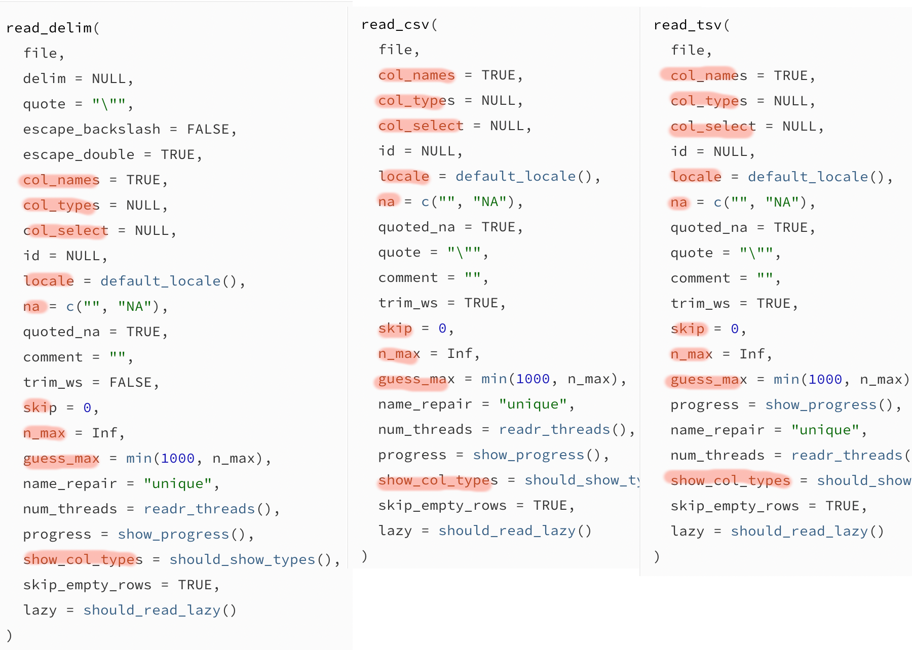
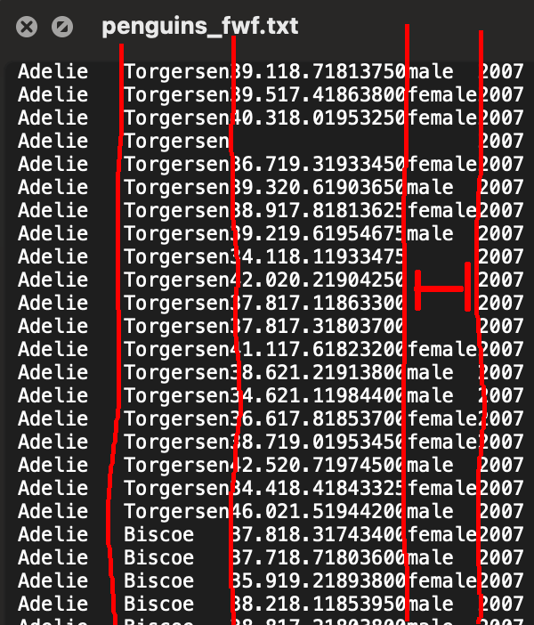

class: center
background-image: url("images/tidyverse-logo.png")
background-size: 350px 

class: right, bottom
###Emmanuel Carranza

---
background-position: 300px 250px
background-image: url("images/tidyverse_packages.png")
background-size: 600px

## Tidyverse
```{r}
library(tidyverse)
library(readxl) 
library(haven)
```

---

background-position: right, top
background-image: url("images/all_logo.png")
background-size: 400px

#Importation des données
###Readr: 
Formats texte : .csv/cvs2, tsv, fwf, .txt, .log
--
###Haven:
format sas(sas7bcat), SPSS(.sav, .zsav, .por) Stata(.dta)
--
###Readxl: 
format excel (.xls, .xlsx)
--
En plus de lire et d'importer plusieurs type de fichiers localement, ces trois packages peuvent aussi lire des fichiers en ligne à partir d'un lien URL. Les fichier compréssés sont aussi accepté.
---

background-image: url(images//readr_logo.png)
background-position: 1050px 50px
background-size: 80px

##Readr (under the hood)

Lors de l'importation d'un fichier, trois choses distinctes se produisent :

**Rectangular parsers**: un fichier texte est transposé sur une matrice rectangulaire de colonnes et de rangers.

--

**Column specification** : le type de chaque colonne (variable) est analysé en fonction des valeurs qui la composent.

--

**Vector parsers**: Assignation du type de classe des observations.

--

##UNDER THE HOOD METAPHORE AVEC PHOTO ET CHAR
Bien que ces étapes se font automatiquement et de façons non visibles, nous avons aussi l'option de modifier manuellement le type de classe des colonnes, leurs noms, combien de valeurs seront affichées et bien plus.
--
Il est important de savoir que ceux-ci peuvent toujours être modifiés après l'importation. Mais le but ici est d'importer les données sous leurs bons formats dès le début.


---
background-image: url(images//readr_logo.png)
background-position: 1050px 50px
background-size: 80px

##Vector parsers (under the hood)

**Atomic:** integer, double, logical et character. Les fonctions parse_logical, parse_integer, parse_double et parse_character sont considérées simples et rigides.

--

**Flexible numeric:** parse_number est flexible puisqu'il peut ignorer les préfixes ou suffixe comme % ou $ qui se retrouve dans la variable.

--

**Date/times**:comprend l'année, le mois, le jour, l'heure,les minutes et les secondes. La grande majorité du temps le format doit être spécifié("%m/%d/%y"). Il y a parse_datetime, parse_date et parse_time.

--

**Factor:** ce type de classe ne sera jamais assigné automatiquement. Il doit toujours être spécifié manuellement à fin d'être inclus ainsi que les différents niveaux qui limitent ses valeurs.

--

Important de comprendre que READR analyse seulement les 1000 premières ranger afin de déterminer la classe pour un rendement plus rapide.

Et donc si le fichier est beaucoup plus gros et qu'on sait que les 1000 premières ne sont pas représentatives, il est primordial de demander à la fonction d'en prendre plus en compte (guess_max)

---

background-image: url(images/readr_logo.png)
background-position: 1050px 50px
background-size: 80px

##Rectangular parsers

.pull-left[
**read_delim()** observations délimitées par un symbole précis que tu specifie

**read_csv()** observations délimitées par des ","
            point décimal par des "."

**read_csv2()** observations délimitées par des ;

**read_tsv()** valeurs délimite par des tab ou /t

**read_fwf()** observations délimitées par la taille en caractère que peut avoir les observations de la même variable

**read_log()** pour les web log files
]

.pull-right[

]

---
background-image: url(images/readr_logo.png)
background-position: 1050px 50px
background-size: 80px

#read.csv vs read_csv

Read.csv() est la fonction de base R qui permet de lire un fichier csv aussi, mais sans faire appel a un package.


##Base R
```{r}
base_r_csv <- read.csv("datasets/penguins_lter.csv")
```

## Readr
```{r}
readr_csv <- read_csv("datasets/penguins_lter.csv",show_col_types = FALSE)
```


La différence est que read_csv accomplit la tâche environ 10 fois plus vite. La différence est presque négligeable avec des petits fichiers, mais est très significative lors d'importation de plus gros fichiers.

---
background-image: url(images/readr_logo.png)
background-position: 1050px 50px
background-size: 80px

##changer l'ordre des colonnes même avec col_select()
```{r}
penguing <- read_csv("datasets/penguins_lter.csv",col_select = list( "Sex","Island","Species"))

head(penguing)
```

---
background-image: url(images/readr_logo.png)
background-position: 1050px 50px
background-size: 80px

#Web log file

En informatique, un web log file est un fichier qui enregistre soit des événements qui se produisent dans un système d'exploitation ou d'autres exécutions de logiciels, soit des messages entre différents utilisateurs d'un logiciel de communication.


---
background-image: url(images/readr_logo.png)
background-position: 1050px 50px
background-size: 80px

##Argument important similaire (csv,csv2,tsv,delim)


---
background-image: url(images/readr_logo.png)
background-position: 1050px 50px
background-size: 80px

##Argument important similaire (csv,csv2,tsv,delim)

**col_names** = si le non des colonnes est deja pris en compte dans la première ranger. Sinon on peut ajouter l'argument pour leur donner un nom.
  
**col_types** = modifier manuellement le type
  
**col_select** = sélection des colonnes à importer
  
**skip** = est-ce qu’on skip certain ranger, cela inclut la première qui contient le nom des colonnes et donc si on skip celle-ci on doit les renommer après.
  
**locale** = utile pour utiliser un encodage universel de caractère (encoding = UTF-8)
  
**n_max** = combien de ligne est-ce qu’on importe
  
**guess_max** = combien de ligne est utilisée pour déterminer le type de classe des valeurs de la colonne

---
background-image: url(images/readr_logo.png)
background-position: 1050px 50px
background-size: 80px

#read_fwf
.pull-left[
Les fixed width files (.txt) sont un peu différent dans le sens que chaque valeur d'une colonne est située à la même place verticalement.


L'attribut de ce type de fichier est qu'il n'y a pas de caractère utiliser pour délimiter les données ce qui rend sont analyse plus rapide si le fichier est très gros. Aussi le fichier serait plus léger en terme de taille puisqu'il y a énormément de caractère qui ne sy trouve pas.

]
.pull-right[

]

---
background-image: url(images//readr_logo.png)
background-position: 1050px 50px
background-size: 80px

#Example 1
taille et nom des colonnes

```{r}
fwf_1 <- read_fwf("datasets/penguins_fwf.txt",
         fwf_widths(widths = c(9, 9, 4, 4, 3, 4, 6, 4),
                    col_names = c("species", "island", 
                                  "bill_length_mm", 
                                  "bill_depth_mm",
                                  "flipper_length_mm", 
                                  "body_mass_g",
                                  "sex",
                                  "year")))
```

---
background-image: url(images//readr_logo.png)
background-position: 1050px 50px
background-size: 80px
#Exemple 2
Positions de départ et de fin des colonnes ainsi que leur nom.
                      
```{r}
fwf_2 <- read_fwf("datasets/penguins_fwf.txt",
         fwf_positions(start = c(1, 10, 19, 23, 27, 30, 34, 40),
                       end = c(9, 18, 22, 26, 29, 33, 39, 43),
                       col_names = c("species",
                                     "island",
                                     "bill_length_mm",
                                     "bill_depth_mm",
                                     "flipper_length_mm",
                                     "body_mass_g",
                                     "sex",
                                     "year")))
```

---
background-image: url(images//readr_logo.png)
background-position: 1050px 50px
background-size: 80px
#Exemple 3
Ici le nom des colonnes est spécifié sur la même ligne que leur taille.
```{r}
fwf_3<- read_fwf("datasets/penguins_fwf.txt",
               fwf_cols(species = c(1, 9),
                        island = c(10, 18),
                        bill_length_mm = c(19, 22),
                        bill_depth_mm = c(23, 26),
                        flipper_length_mm = c(27, 29),
                        body_mass_g = c(30, 33),
                        sex = c(34, 39),
                        year = c(40, 43)))
```

---
background-image: url(images//readr_logo.png)
background-position: 1050px 50px
background-size: 80px

#Example 4 avec fwf_cols
Presque la même chose, mais pas le début et la fin de la colonne, mais juste la taille.

```{r}
fwf_4 <- read_fwf("datasets/penguins_fwf.txt", 
                       fwf_cols(
                         species = 9,
                         island = 9,
                         bill_length_mm = 4,
                         bill_depth_mm = 4,
                         flipper_length_mm = 3,
                         body_mass_g = 4,
                         sex = 6,
                         year = 4))
```


---
background-image: url(images//readr_logo.png)
background-position: 1050px 50px
background-size: 80px

#Modifier le type

Dans le data set fwf_4 que je viens de créée, sexe est une variable character puisque juste constitue de lettres et year est considéré double avec ces chiffres.  

spec(fwf_4)
```{r}
spec(fwf_4)
```


---
background-image: url(images//readr_logo.png)
background-position: 1050px 50px
background-size: 80px

#Specifier le type de la colonne

```{r}
fwf_5 <- read_fwf("datasets/penguins_fwf.txt", 
                    fwf_cols(species = 9, 
                            island = 9,
                            bill_length_mm = 4,
                            bill_depth_mm = 4,
                            flipper_length_mm = 3,
                            body_mass_g = 4,
                            sex = 6,
                            year = 4),col_types = cols(sex = col_factor(),
                                    year = col_integer()))

spec(fwf_5)
                    
```

---
background-image: url(images//readr_logo.png)
background-position: 1050px 50px
background-size: 80px

#Type de classe

Chaque classe correspond aussi à une abréviation qui peut être utilisé à la place du mot entier.


---
background-image: url(images//readxl_logo.png)
background-position: 1050px 50px
background-size: 80px
#READXL

readxl ne fait pas partie des package préloader avec tidyverse alors il faut bien s’assurer de :

```{r}
library(readxl)
```

il y a la fonction : read_excel, read_xlsx et read_xls

La différence avec read_excel est que read_excel doit interpréter le format du fichier avec une autre fonction excel_format (qu’on ne voit pas).


Alors si on connait déjà le format c’est préférable d’utiliser celle qui lui correspond.


```{r}
excel1 <- read_xlsx("datasets/penguins.xlsx")
```


---
background-image: url(images//readxl_logo.png)
background-position: 1050px 50px
background-size: 80px

#Arguments readxl

**path**	: ou ce trouve le fichier xls/xlsx 

**sheet**	: soit le nom de la page ou son numéro.Par défaut, c’est juste la première.

**range**	: positions des cellules comme  "B3:D87"

**col_names**	: = TRUE #première ranger vont être les noms, 
        FALSE = tu va devoir les nommer 
        
**col_types**	: par défaut c’est NULL et readxl va interpréter le type lui-même. Ici on a encore interger, double, factor

**na**	 : le caractère utiliser pour les donner manquantes, par défaut une case blanche est un NA dans excel

**skip**	 :combien de ranger on doit skipper pour analyser le fichier

**n_max**	: combien de ranger il faudra analyser en entierMaximum number of data rows to read. Ignorer si l'argument range est utiliser

**guess_max**	 :nombre maximum de ranger utiliser pour décider du type de classe des valeurs d'une colonne. Encore une fois il prend juste les 1000 premières.

---
background-image: url(images//readxl_logo.png)
background-position: 1050px 50px
background-size: 80px
#Column specification

dans excel le type "character" est interchangeable pour "text",

on peut aussi utiliser ces abreaviations à la place des mots entiers


---
background-image: url(images//haven_logo.png)
background-position: 1050px 50px
background-size: 80px
#Haven

Haven n'est pas activé avec Library(TidyVerse)

On a pas de le choix de 

```{r}
library(haven)
```


**SAS** : read_sas() et read_xpt()

**SPSS** :read_sav() et read_por()

**Stata** : read_dta()

---
background-image: url(images//haven_logo.png)
background-position: 1050px 50px
background-size: 80px

##Labelled vectors

SAS, SPSS, et Stata contienne un concept appeler “labelled vectors " C'est l'équivalent d’une description assigner a une ou plusieurs valeurs. C'est pour la compréhension de l'humain lisant les données et non pour la machine.

labelled()
print labelled()

##Tagged missing values
Sas et stata comprennent les NA mais ils peuvent avoir plusieurs types de NA (avec différent niveau allant de A a Z)

tagged_na() fournit un moyen pratique de représenter ces types de valeurs manquantes dans R en tirant parti de la représentation binaire de NA.

background-image: url(images//haven_logo.png)
background-position: 1050px 50px
background-size: 80px

##Remove attributes
Il existe un certain nombre de fonctionnalités SPSS/SAS/Stata qui n'ont pas d'équivalent direct dans R. Haven les préserve afin que vous puissiez choisir ce que vous en faites. Pour les éliminer simplement, utilisez l'une des fonctions de zap.

zap_empty() : Convertis les valeurs manquant en NA

zap_formats() :Haven stocke les formats de variables dans un attribut: format.stata, format.spss ou format.sas. Si cela pose des problèmes pour votre code, vous pouvez vous en débarrasser avec zap_formats

zap_label() :Supprime l'étiquette de variable, laissant les vecteurs non étiquetés tels quels. zap_labels() pour l'ensemble

zap_widths() enlève l’attribut de la largeur des valeurs

---
background-image: url(images/thatsall.gif)
---
